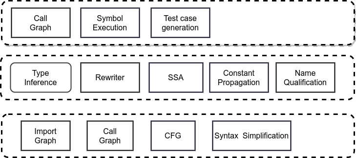

# Scalpel.

Static Anaysis for Python Programs
==================================
Scalpel is a Python module integrating classical program anaysis algorithms
with tailored features for Python language. It aims to provide simple and
efficient solutions to software engineering researchers that are accessible to
everybody and reusable in various contexts.
See xxx and xx for complete documentation and user guide.

## Introduction
## TODO (Apps)
- [ ] Python different type of function arguments 
- [ ] build an graph, to test reachbility for compitibity
- [ ] Fix issues in CFG module including testing 
- [ ] intra-lib dependency  and inter-lib dependeny
- [ ] User GUID
- [ ] SSA-> None object not handled to see if there are in real Jupyter projects
- [ ] SSA-> undefined variable tests 
## TODO (Done)
- [x] get_class
- [x] get_fun_call
- [x] get member functions
- [x] get class inheritence
- [x] package dependency
- [x] entry point detection
- [x] cross reference	
- [x] base class 
- [x] import * 
- [x] import flow of classes
- [x] Control Flow Graph
- [x] access attributes
- [x] class in classes
- [x] function in functions (def)

## Acknowledgement
This project has been inspired and supported by the following work. Some implementation of functionalities are taken from published work.

1. [Fuzzyingbook](https://www.fuzzingbook.org/).

2. [Debugging book](https://www.debuggingbook.org/).

3. [StaticCFG](https://github.com/coetaur0/staticfg).

4. [PyCG: Practical Call Graph Generation in Python. In 43rd International Conference on Software Engineering, 2021](https://vitsalis.com/papers/pycg.pdf). 
5. [A Simple, Fast Dominance Algorithm](https://www.cs.rice.edu/~keith/EMBED/dom.pdf) Keith D. Cooper, Timothy J. Harvey, and Ken Kennedy
6. [COS598C Advanced Compilers](https://www.cs.princeton.edu/courses/archive/spr04/cos598C/lectures/02-ControlFlow.pdf), Princeton University

