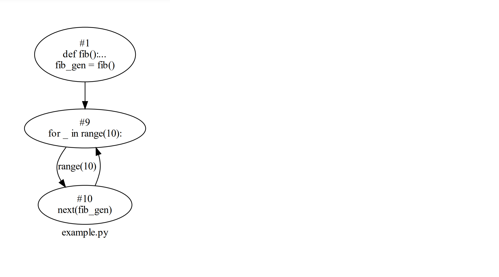

## Control Flow Graph
`scalpel.cfg` module is used to construct the control flow graph for given python programs. The basic unit in the CFG, `Block`, contains a list of sequential statements that can be executed in a program without any control jumps. The `Block`s are linked by `Link` objects, which represent control flow jumps between two blocks and contain the jump conditions in the form of an expression. The two components are the fundemental data structures in the control flow graph module (`scalpel.cfg`).


### How to use Control Flow Graph
Below is the demo input python program we will be using. The piece of code generates the Fibonacci sequence.
```python
code_str="""
def fib():
    a, b = 0, 1
    while True:
        yield a
        a, b = b, a + b

fib_gen = fib()
for _ in range(10):
    next(fib_gen)
"""
```
To build the cfg of a source string, simply import `CFGBuilder` in `scalpel.cfg` and use `build_from_src(name, file_path)`. Other functions can also be used to build a cfg from an python AST tree or a source file.

```python
from scalpel.cfg import CFGBuilder

cfg = CFGBuilder().build_from_file('example.py', './example.py')

```
This returns the CFG for the code in *./example.py* in the cfg variable. This built CFG can be visulized with `build_visual`:
```python
cfg.build_visual('pdf')
```
Below is the produced *exampleCFG.pdf*.

Apart from generating the visual graph, the CFG can be use for many other static analysis purpose.
For example, `get_calls` can be used to get all function calls in each block.
```python
for block in cfg:
    calls = block.get_calls()
```
`backward` can be used to find a variable's value, if not found in the current block, by backtracing in the CFG.
```python
example_block = cfg.get_all_blocks()[-1]
a_value = cfg.backward(example_block,'a',[],[])
```
One can also combined call graph and CFG to construct interprecedual CFG.
\
The tutorial code can be found here:\
&nbsp;&nbsp;&nbsp;&nbsp;&nbsp;&nbsp;[Control Flow Graph Example](../examples/cfg_tutorial.py)

### APIs
[Please refer to the API documentation](https://smat-lab.github.io/Scalpel/scalpel/cfg.html)

### Reference
1. [StaticCFG](https://github.com/coetaur0/staticfg).
2. [ECE 5775 High-Level Digital Design Automation](https://www.csl.cornell.edu/courses/ece5775/pdf/lecture06.pdf), Cornell University
3. [CS153: Compilers](https://groups.seas.harvard.edu/courses/cs153/2018fa/lectures/Lec17-CFG-dataflow.pdf), Harvard University
